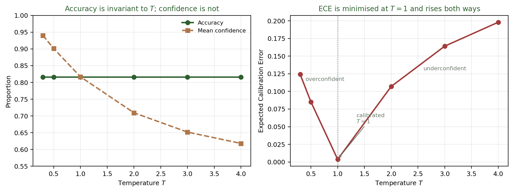
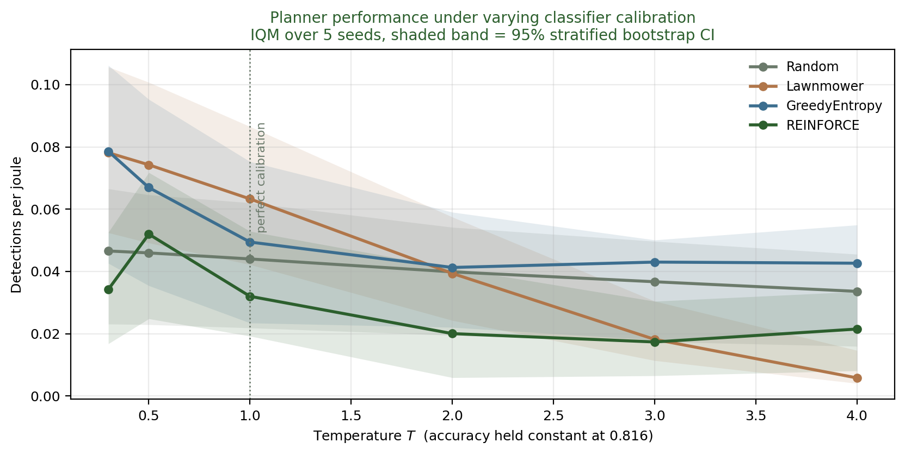
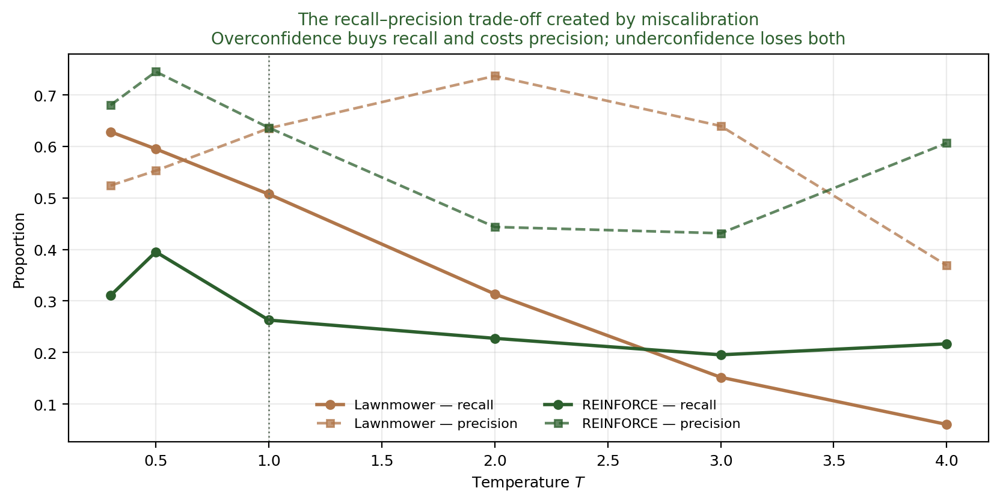
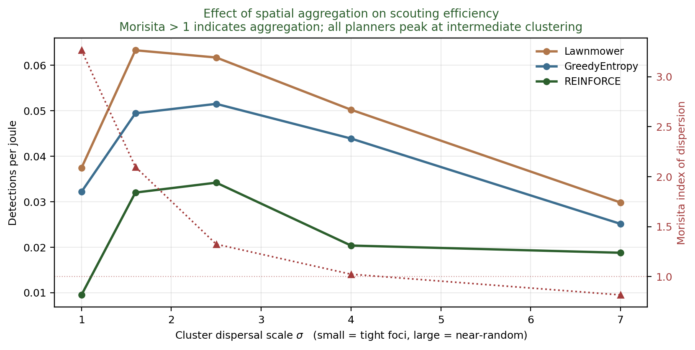
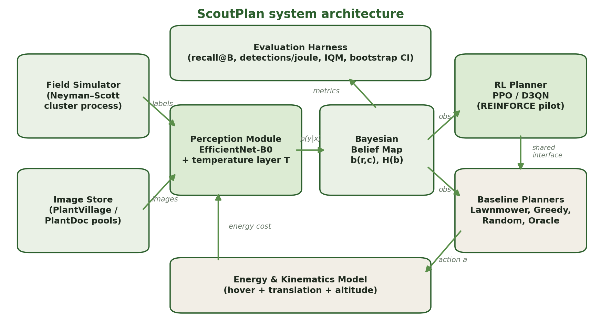
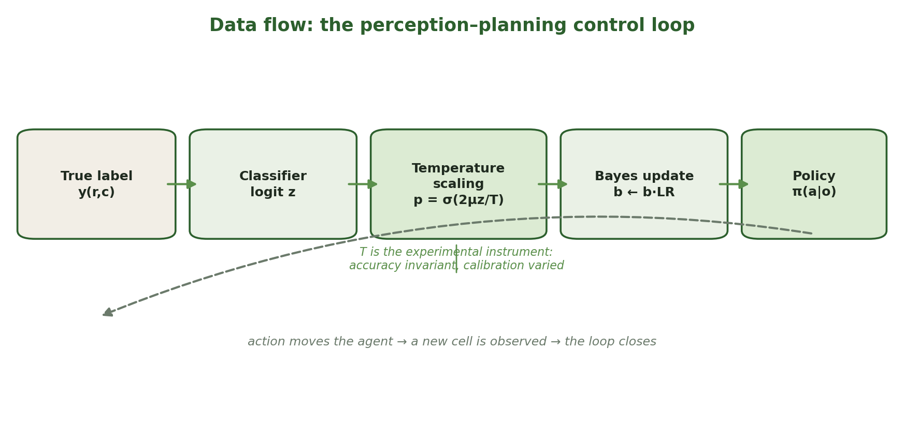
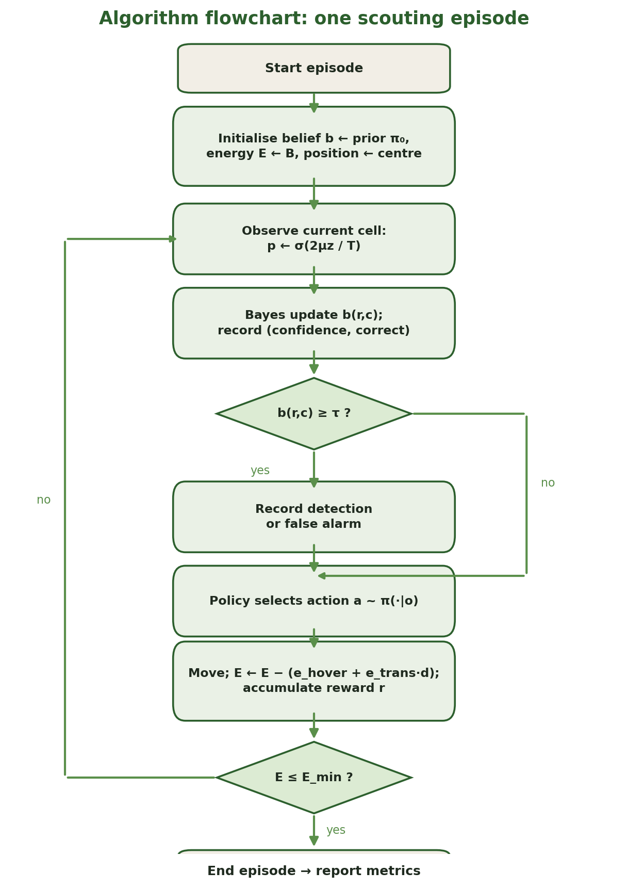
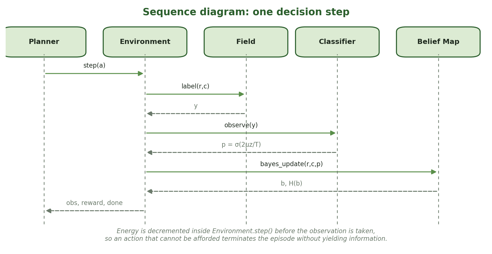

# scoutplan

**A miscalibrated classifier can cost a drone 13× its detection efficiency without losing
a single point of accuracy.** A NumPy-only pilot study that measures how classifier
calibration error propagates through an informative path planner into mission outcomes.

Reproduction package for **_Development and Evaluation of a Calibration-Aware REINFORCE
Agent for Energy-Efficient Aerial Agricultural Surveillance_** — Odusina, 2026, Miva Open
University. <!-- TODO: link the paper here once published. -->


No budget, no GPU, no paid data. The full sweep runs in about fifteen minutes on a
free-tier Colab or Kaggle kernel.

> **This repository is frozen at `v1.0.0`.** It is the reproduction package for the
> numbers below and does not change. Active development continues in
> [**scoutfield**](https://github.com/OSegun/scoutfield), which replaces the surrogate
> classifier with a fine-tuned EfficientNet-B0 and REINFORCE with PPO, and pins this
> repository as a dependency.

---

## The question

Informative path planning decides where to look next by maximising expected information
gain. It assumes the signal it consumes — a classifier's reported confidence — is
calibrated. Deep classifiers are systematically miscalibrated (Guo et al., 2017) and
degrade further under the distribution shift a field deployment guarantees. Nobody had
quantified how that error propagates into planner performance: the question falls between
two literatures, because path planning assumes good uncertainty and the calibration
community never closes a control loop around it.

**RQ1** — Does spatial aggregation of disease change the advantage of an adaptive planner
over a fixed-coverage baseline?
**RQ2** — How does miscalibration, *at fixed accuracy*, affect detections per joule,
recall, precision and false alarms?

## The instrument

Temperature scaling divides classifier logits by a scalar `T` before the decision link.
Because the link is strictly monotone and the decision boundary sits at logit 0, dividing
by any `T > 0` cannot move the arg-max — so **accuracy is invariant while confidence is
not**. Sweeping `T` sweeps calibration error with accuracy pinned, which is the only way to
attribute an effect to calibration rather than to accuracy.

<p align="center">
  
</p>

**Figure 5.** The instrument working. Accuracy (left, solid) is a flat line at **0.8161**
across every temperature — identical to four decimal places, which the test suite asserts.
Mean confidence (dashed) falls from 0.940 at `T`=0.3 to 0.618 at `T`=4. ECE (right) is
minimised at `T`=1 (0.0037) and rises in *both* directions, to 0.124 when overconfident and
0.198 when underconfident. That V shape is what makes direction separable from magnitude —
and direction turns out to be what matters.

A real CNN cannot give this counterfactual, because accuracy and calibration co-vary under
retraining. Only a post-hoc scalar separates them. That is why the pilot uses a surrogate,
and why replacing it with a real classifier is the next phase's job rather than this one's.

| `T` | Accuracy | ECE | Mean confidence | Direction |
| --- | --- | --- | --- | --- |
| 0.3 | 0.816075 | 0.1241 | 0.9402 | overconfident |
| 0.5 | 0.816075 | 0.0852 | 0.9013 | overconfident |
| **1.0** | 0.816075 | **0.0037** | 0.8170 | **calibrated** |
| 2.0 | 0.816075 | 0.1070 | 0.7095 | underconfident |
| 3.0 | 0.816075 | 0.1641 | 0.6519 | underconfident |
| 4.0 | 0.816075 | 0.1980 | 0.6180 | underconfident |

<sub>`results/calibration_table.csv`. Accuracy is identical down the column. That is the
premise of the entire study, not a coincidence.</sub>

---

## Results

195 executed runs: 4 planners × 6 temperatures × 5 seeds, plus a clustering sweep.
Interquartile mean with 95% stratified bootstrap confidence intervals throughout, per
Agarwal et al. (2021) — never mean ± std over three seeds, which is the commonest reason
RL results fail to replicate.

### 1. Calibration error changes planner performance, at fixed accuracy

<p align="center">
  
</p>

**Figure 6.** Detections per joule against `T`. Accuracy is constant along the x-axis, so
every change here is caused by calibration alone.

| Planner | `T`=0.3 | `T`=1.0 | `T`=4.0 | Degradation 0.3→4 |
| --- | --- | --- | --- | --- |
| Random | 0.0466 | 0.0440 | 0.0336 | 1.39× |
| **Lawnmower** | **0.0781** | 0.0633 | **0.0058** | **13.4×** |
| GreedyEntropy | 0.0786 | 0.0494 | 0.0427 | **1.84×** |
| REINFORCE | 0.0342 | 0.0320 | 0.0215 | 1.59× |

<sub>`results/summary.json`. IQM over 5 seeds; CIs in the JSON and as shaded bands above.</sub>

The coverage baseline collapses **13.4×** while its accuracy does not move at all. That is
the headline: an engineer swapping in a classifier with identical benchmark accuracy but
worse calibration would see mission efficiency fall by an order of magnitude and find
nothing wrong with the model.

**The ranking reverses.** Lawnmower beats GreedyEntropy at `T` ≤ 1 and loses to it **7.3×**
at `T`=4. Which planner you should deploy depends on how well calibrated your classifier
is — a dependency no planning paper states, because none of them vary calibration.

### 2. H2 refuted: direction governs, not magnitude

The pre-registered hypothesis was that performance degrades monotonically with ECE. It does
not. ECE at `T`=0.3 (0.1241) and `T`=2.0 (0.1070) are comparable, but Lawnmower scores
0.0781 at the first and 0.0394 at the second — a 2× difference at near-equal ECE. The sign
of the error is what matters.

<p align="center">
  
</p>

**Figure 7.** The mechanism. Miscalibration enters the environment as a *systematic bias in
Bayesian belief updates*, not as additive noise — which is why it has a direction at all.

- **Overconfidence** (`T` < 1) inflates belief on every observation, so the confirmation
  threshold is crossed readily. Lawnmower recall reaches **0.628** at `T`=0.3, but precision
  drops to 0.524 and false alarms rise to **13.0** per episode. It finds more disease and
  cries wolf more often.
- **Underconfidence** (`T` > 1) deflates belief, so the threshold is rarely crossed. Recall
  falls to **0.060** at `T`=4 — a tenfold loss. Precision peaks at 0.737 around `T`=2 and
  then collapses to 0.369, because by `T`=4 there are so few confirmations left that the
  ratio becomes noise. Time to first detection stretches from **11.1** steps to **61.8**.

An overconfident classifier trades precision for recall. An underconfident one loses both.
Two systems with the same ECE and the same accuracy fail in opposite ways, and any summary
that reports only ECE magnitude cannot distinguish them.

GreedyEntropy is the interesting case: its false alarms climb from 12.4 to **32.0** as `T`
rises, because it deliberately seeks out high-entropy cells and underconfidence makes
everything look uncertain. It stays efficient by continuing to find disease, but it pays
for that in precision.

### 3. H1 not supported: clustering does not predict planner advantage

<p align="center">
  
</p>

**Figure 8.** Disease is generated by a Neyman–Scott cluster process, because field
epidemiology reports aggregated rather than uniform patterns. Aggregation is *measured* via
the Morisita index (dotted, right axis) rather than asserted: it falls from 3.26 at σ=1.0 to
0.82 at σ=7.0, crossing 1.0 — the random threshold — near σ=4.

The prediction was that adaptive planners gain most on tightly clustered fields. They do
not. **All three planners peak at intermediate dispersal** (σ=1.6 for Lawnmower, σ=2.5 for
GreedyEntropy and REINFORCE), and the *gap* between them stays roughly constant. Tight
clusters are hard for everyone: at σ=1.0 the disease occupies so few cells that a planner
which has not stumbled into a focus has nothing to exploit, and REINFORCE drops to 0.0095
detections per joule with recall of 0.10.

The hypothesis is reported as not supported. It was pre-registered, it failed, and burying
it would make the two that survived less believable.

### 4. The learned planner lost

REINFORCE is beaten by the lawnmower baseline at **every** temperature — 0.0320 against
0.0633 at `T`=1. It is comparatively robust (1.59× degradation against 13.4×) but never
absolutely better.

Three identified causes, none of them flattering:

1. **The field was too small to require selectivity.** A 12×12 grid with `BUDGET`=190
   permits ~78% coverage, and the lawnmower achieves exactly that. When you can visit most
   of the field, a fixed sweep is near-optimal by construction and there is nothing for
   adaptivity to buy. REINFORCE covered 20%; that would be an advantage only if coverage
   were genuinely scarce.
2. **The observation was myopic.** The agent saw a 5×5 local patch and three scalars. It
   could hill-climb toward nearby belief but could not plan a route to a distant focus.
3. **REINFORCE is sample-inefficient.** No value baseline, no trust region, and a reward
   dominated by rare detection events — 400 training episodes is not enough.

All three are addressed in the next phase, and stating them here is what makes that phase's
result interpretable if it improves.

---

## Install and reproduce

```bash
git clone https://github.com/OSegun/scoutplan.git
cd scoutplan                       # required: the modules use flat imports
pip install -r requirements.txt    # numpy + matplotlib. That is all.
```

```bash
python run.py smoke      # ~12 s: field, instrument, one rollout. Asserts accuracy invariance.
python run.py sweep      # 195 jobs, ~15 min, resumable and interrupt-safe
python run.py figures    # Figures 5-8 + results/summary.json, from the CSVs
python -m pytest         # 4 invariant tests
```

`run.py sweep` is safe to Ctrl-C and re-run. It checkpoints completed jobs to
`results/_done.json` and resumes; the execution environments this was built for kill long
processes.

**To restart a sweep cleanly, delete `results/_done.json` *and* the results CSVs.** Deleting
one leaves the driver resuming and appending fresh rows to stale ones, with no warning that
the analysis now mixes two code versions.

### Number → command

| Number | File | Command |
| --- | --- | --- |
| Accuracy / ECE / confidence per `T` | `results/calibration_table.csv` | `run.py figures` |
| Detections per joule, IQM + CI | `results/summary.json` | `run.py sweep` then `figures` |
| Recall, precision, false alarms, TTFD, coverage | `results/summary.json` | `run.py sweep` then `figures` |
| Per-run raw rows | `results/pilot_results.csv` | `run.py sweep` |
| Clustering sweep + Morisita | `results/cluster_sweep.csv`, `summary.json` → `_cluster` | `run.py sweep` |

Every number in this README is read from those files. If a number here disagrees with them,
this README is wrong.

---

## Design

Figures 1–4 describe the design rather than the data, so they are authored once and do not
change when a sweep is re-run. They are shipped here — as PNGs and as editable `.drawio`
sources in `drawio/`, importable into diagrams.net or Visio — for reuse and modification.
They are not regenerated by anything in this repository, which is deliberate: diagram
authoring is a presentation concern, and keeping it out is part of what keeps the
reproduction package NumPy-only. Figures 5–8, the ones that carry results, *are*
regenerated here by `run.py figures`.

<p align="center">
  
</p>

**Figure 1.** Five components. The calibration instrument is the only thing that varies
across the main sweep; everything else is held fixed, which is what makes the comparison
clean.

<p align="center">
  
</p>

**Figure 2.** Data flow. Note where miscalibration enters: at the Bayesian belief update,
as a bias on the likelihood ratio. That placement is the study's mechanism claim — a
miscalibrated classifier does not add noise to the planner's world model, it *skews* it, and
the skew compounds over an episode.

<p align="center">
  
</p>

**Figure 3.** The episode loop. A detection is confirmed when posterior belief exceeds
τ = 0.75, which is where the temperature manipulation makes contact with the outcome —
see the limitation below.

<p align="center">
  
</p>

**Figure 4.** One timestep. The environment's only contact with perception is a single call:

```python
CalibratedClassifier.observe(true_label: int) -> tuple[float, int]
#                                                (probability, hard_prediction)
```

Swapping in a real CNN means changing only this method — which is exactly what
[scoutfield](https://github.com/OSegun/scoutfield) does. Everything downstream is unchanged,
so any difference in result is attributable to the classifier.

### Layout

```
scoutplan/
├── scipy_free.py            norm_ppf; removes the SciPy dependency
├── field.py                 Neyman-Scott disease field + Morisita index
├── perception.py            ⭐ the calibration instrument + ECE
├── env.py                   POMDP, Bayesian belief, energy model
├── agents.py                Random, Lawnmower, Spiral, GreedyEntropy, REINFORCE
├── experiment.py            single-run harness + IQM/bootstrap statistics
├── run_jobs.py              resumable parallel sweep driver
├── make_result_figures.py   Figures 5-8 + results/summary.json
├── run.py                   CLI: smoke | sweep | figures | all
├── tests/test_invariants.py 4 regression tests
├── results/                 CSVs + summary.json   (generated by run.py sweep/figures)
├── figures/                 Figures 1-8 PNG       (5-8 generated; 1-4 shipped)
└── drawio/                  editable sources for Figures 1-4 (shipped)
```

Read and modify in dependency order:
`scipy_free → field → perception → env → agents → experiment → run_jobs → run`.

**Flat imports.** `env.py` does `from perception import ...`, so every command must be run
from inside this directory.

### Parameters

```
TEMPERATURES = [0.30, 0.50, 1.00, 2.00, 3.00, 4.00]
SEEDS        = [0, 1, 2, 3, 4]        BASE_ACC = 0.816    # Ahmad et al. (2023)
GRID  = 12       BUDGET = 190.0       PRIOR = 0.15        TAU = 0.75
TRAIN_EPISODES = 400                  EVAL_EPISODES = 20
E_HOVER = 1.0    E_TRANSLATE = 0.6    reward: alpha=1.0, lam=6.0, mu=0.15
```

`experiment.py` is the source of truth. Every physical constant traces to a cited paper;
where a value is invented it is swept rather than defended.

### Invariants

Four properties the test suite enforces. A change that breaks one is a bug, not a trade-off.

1. **Accuracy is invariant to `T`**, to four decimal places. This is the study's premise.
2. **ECE is minimised at `T` = 1** and rises in both directions. If it becomes monotone, the
   parameterisation is broken and H2 is no longer testable.
3. **Every run reproduces from `(agent, seed, T, sigma)`.** No unseeded RNG, no wall-clock
   or PID entropy anywhere in the experiment path.
4. **Baselines get the same observation and pay the same energy** as the learned agent. The
   proposed method is never advantaged through the interface.

---

## Limitations

Stated plainly, because the effect sizes above depend on them.

**τ = 0.75 interacts with `T` by construction.** A detection is confirmed when belief
exceeds τ, and temperature scaling moves how often any fixed threshold is crossed. Some
portion of the 13.4× collapse is attributable to the threshold rather than to
miscalibration itself, and this study does not separate them. **The effect size should be
read as "at τ = 0.75", not as a general magnitude.** The sensitivity analysis that would
settle it is the first item in the next phase.

**The classifier is a surrogate, not a network.** That is what buys the accuracy-invariance
counterfactual, and it is also the main threat to external validity. A real classifier's
errors are correlated with image content in ways a class-conditional Gaussian is not.

**The field is simulated.** Constants are cited where cited values exist, but no drone flew.

**The learned planner is REINFORCE with 400 episodes** — chosen because it needs no deep
learning framework and therefore runs in the constrained environment, not because it is the
right algorithm. Its loss to the baseline should be read as a statement about this
configuration, not about learned planning.

---

## Citing

This repository is the reproduction package for a seminar paper. **Cite the paper for the
study, its method and its findings**; cite the software only when referring to the code or
the data.

```bibtex
@mastersthesis{odusina2026calibration,
  author      = {Odusina, Oluwasegun Ibrahim},
  title       = {Development and Evaluation of a Calibration-Aware {REINFORCE} Agent
                 for Energy-Efficient Aerial Agricultural Surveillance},
  school      = {Miva Open University},
  year        = {2026},
  type        = {Seminar paper},
  note        = {Reproduction package: \url{https://github.com/OSegun/scoutplan}}
  % url       = {}   TODO: add the paper link once published
}
```

<details>
<summary>Citing the software itself</summary>

```bibtex
@software{odusina2026scoutplan,
  author  = {Odusina, Oluwasegun Ibrahim},
  title   = {ScoutPlan: calibration-aware active sensing for energy-constrained
             aerial crop scouting},
  year    = {2026},
  version = {v1.0.0},
  url     = {https://github.com/OSegun/scoutplan},
  note    = {Reproduction package for Odusina (2026)}
}
```

</details>

[`CITATION.cff`](CITATION.cff) declares the paper as `preferred-citation`, so GitHub's
"Cite this repository" button and most reference managers will offer the paper first.
MIT licensed.

## References

Agarwal, R., Schwarzer, M., Castro, P. S., Courville, A., & Bellemare, M. G. (2021). Deep
reinforcement learning at the edge of the statistical precipice. *NeurIPS 34*.

Ahmad, A., Saraswat, D., & El Gamal, A. (2023). A survey on using deep learning techniques
for plant disease diagnosis. *Smart Agricultural Technology, 3*, 100083.

Colas, C., Sigaud, O., & Oudeyer, P.-Y. (2019). A hitchhiker's guide to statistical
comparisons of reinforcement learning algorithms. *arXiv:1904.06979*.

Frenkel, L., & Goldberger, J. (2022). Calibration of medical imaging classification systems
with weight scaling. *MICCAI 2022*.

Guo, C., Pleiss, G., Sun, Y., & Weinberger, K. Q. (2017). On calibration of modern neural
networks. *ICML 34*.

Heck, D. W., et al. (2021). Spatial pattern analysis of plant disease epidemics.
*Phytopathology*.

Williams, R. J. (1992). Simple statistical gradient-following algorithms for connectionist
reinforcement learning. *Machine Learning, 8*, 229–256.

---

**Topics:** `reinforcement-learning` `uncertainty-quantification` `calibration`
`informative-path-planning` `active-sensing` `precision-agriculture` `numpy`
`reproducible-research` `paper-implementations`
